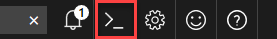
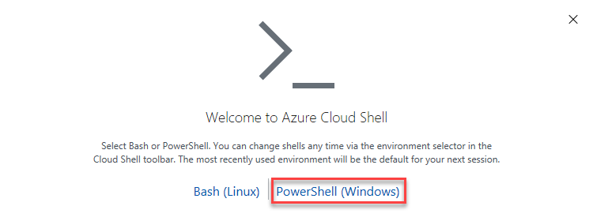
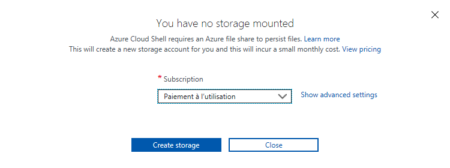
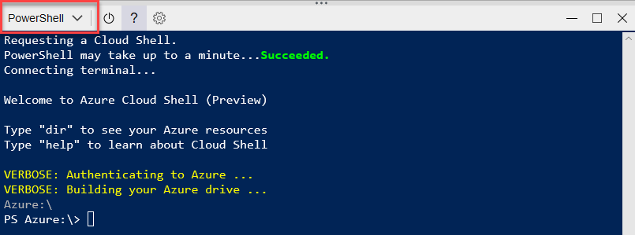

<a name="HOLTitle"></a>
# Provision Customer Reviews Services and Reset datas#

---

<a name="Overview"></a>
## Overview ##

Azure Resource Manager helps automate the provisionning of a lot of resources in Azure.

In this lab, you will create the needed Azure Services for to run CustomerReviews web site and his automatic moderation with Cognitives Services. You will also add images to populate CustomerReviews site.

<a name="Objectives"></a>
### Objectives ###

In this hands-on lab, you will learn how to:

- Create Azure Services for labs 02 and 03
   + storage account 
   + DocumentDb database
   + Cognitives Services
   + Application Service
   + Azure Functions 
- Deploy Web site of CutomerReviews
- Set images data in storage and Document

<a name="Prerequisites"></a>
### Prerequisites ###

The following are required to complete this hands-on lab:

- An active Microsoft Azure subscription. If you don't have one, [sign up for a free trial](http://aka.ms/WATK-FreeTrial).
- An active GitHub account. If you don't have one, [sign up for free ](https://github.com/join). (optional)

---

<a name="Exercises"></a>
## Exercises ##

This hands-on lab includes the following exercises:

- [Exercise 1: Create an Azure Cloud Shell (PowerShell)](#Exercise1)
- [Exercise 2: Fork and Clone GitHub repo](#Exercise2)
- [Exercise 3: Create services with Azure Resource Manager template](#Exercise3)
- [Exercise 4: Add images to CustomerReviews site (Reset datas)](#Exercise4)

Estimated time to complete this lab: **20** minutes.

<a name="Exercise1"></a>
## Exercise 1: Create an Azure Cloud Shell (PowerShell) ##

The first step in .... In this exercise, you will create .....

1. Open the [Azure Portal](https://portal.azure.com) in your browser. If asked to log in, do so using your Microsoft account.

1. Click **Cloud Shell** button on top of page
   
    

	> A banner appear on the back of web page 
     
1. Click **PowerShell (Windows)**

    

1. Select your subscription, and Click on **Create storage**. This will create a new storage account for you and create a file share to persist files.
   
    

1. Your Cloud Shell be ready in a few minutes .

    
	
The Azure Cloud Shell is a windows container. A new one will be started with your CloudDrive mapped as a volume. And you will be connected to your Azure current subscription. has been created and you have added three containers to the storage account created for it. The next step is to get code from this repo.

TODO: sample: 1. Repeat Step 7 to add containers named "accepted" and "rejected" to blob storage.
TODO: next exercises

<a name="Exercise2"></a>
## Exercise 2: Fork and Clone GitHub repo ##

Once you have created an Azure Function App, you can add Azure Functions to it. In this exercise, you will add a function to the Function App you created in [Exercise 1](#Exercise1) and write C# code that uses the [Computer Vision API](https://www.microsoft.com/cognitive-services/en-us/computer-vision-api) to analyze images added to the "uploaded" container for adult or racy content.

1. Return to the blade for the "FunctionsLabResourceGroup" resource group and click the Azure Function App that you created in [Exercise 1](#Exercise1). 

    

    _Opening the Function App_

	
3. Enter an app name that is unique within Azure. Under **Resource Group**, select **Create new** and enter "FunctionsLabResourceGroup" (without quotation marks) as the resource-group name to create a resource group for the Function App. Choose the **Location** nearest you, and accept the default values for all other parameters. Then click **Create** to create a new Function App.

	> The app name becomes part of a DNS name and therefore must be unique within Azure. Make sure a green check mark appears to the name indicating it is unique. You probably **won't** be able to use "functionslab" as the app name.
    
	

    _Creating a Function App_

1. Replace the code shown in the code editor with the following statements:


```C#
#r "System.IO"
using Microsoft.ProjectOxford.Vision;
public async static Task Run(Stream myBlob, Stream acceptedBlob, Stream rejectedBlob,string name, CancellationToken token, TraceWriter log)
{
    
    log.Info($"C# Blob trigger function Processed blob\n Name:{name} \n Size: {myBlob.Length} Bytes");
    VisualFeature[] VisualFeatures = { VisualFeature.Description };
 
}
```


1. Click the **Save** button at the top of the code editor to save your changes. Then click **View files**.

    

    _Saving the function_

1. Add the following statements to **project.json**:

	```json
	{
	    "frameworks": {
	        "net46": {
	            "dependencies": {					"Microsoft.ProjectOxford.Vision": "1.0.393",
	                "WindowsAzure.Storage": "7.2.0"
	            }
	        }
	    }
	}
	```

Add a new output to your function use acceptedBlob as your Blob Parameter Name and accepted for your path, and save this new output. 
Repeat this steps to add an another output with rejectedBlob as your Parameter Name and rejected for your path and save this new output. 


An Azure Function written in C# has been created, complete with a JSON project file containing information regarding project dependencies. The next step is to add an application setting that the Azure Function relies on.

<a name="Exercise3"></a>
## Exercise 3: Create services with Azure Resource Manager template ##

The Azure Function you created in [Exercise 2](#Exercise2) loads a subscription key for the Microsoft Cognitive Services Computer Vision API from application settings. This key is required in order for your code to call the Computer Vision API, and is transmitted in an HTTP header in each call. In this exercise, you will subscribe to the Computer Vision API, and then add an access key for the subscription to application settings.

1. In the Azure Portal, click **+ New**, followed by **AI + Cognitive Services** and **Computer Vision API**.

    

    _Creating a new Computer Vision API subscription_

1. Enter "VisionAPI" into the **Name** box and select **F0** as the **Pricing tier**. Under **Resource Group**, select **Use existing** and select the "FunctionsLabResourceGroup" that you created for the Function App in Exercise 1. Check the **I confirm** box, and then click **Create**.

    

    _Subcribing to the Computer Vision API_


The work of writing and configuring the Azure Function is complete. Now comes the fun part: testing it out.

<a name="Exercise4"></a>
## Exercise 4: Add images to CustomerReviews site (Reset datas) ##

Your function is configured to listen for changes to the blob container named "uploaded" that you created in [Exercise 1](#Exercise1). Each time an image appears in the container, the function executes and passes the image to the Computer Vision API for analysis. To test the function, you simply upload images to the container. In this exercise, you will use the Azure Portal to upload images to the "uploaded" container and verify that copies of the images are placed in the "accepted" and "rejected" containers.

1. In the Azure Portal, go to the resource group created for your Function App. Then click the storage account that was created for it.

    

    _Opening the storage account_

1. Click **Blobs** to view the contents of blob storage.

    

    _Opening blob storage_

The presence of seven images in the "accepted" container and one in the "rejected" container is proof that your Azure Function executed each time an image was uploaded to the "uploaded" container. If you would like, return to the BlobImageAnalysis function in the portal and click **Monitor**. You will see a log detailing each time the function executed.


<a name="Summary"></a>
## Summary ##

In this hands-on lab you learned how to:

- Create Azure Services with Azure Resource Manager templates
- Execute PowerShell and Command srcipts in Azure Cloud Shell
- Use Azure Web Apps and deployment engine (Kudu) to automate build and deploy of a Web site from a GitHub repo.

This is just one example of how you can leverage Azure Resource Managemeer and Azure Cloud Shell to automate infrastructure. Experiment with other Azure Resource Manager templates to learn more about Azure Services and provisionning to identify additional ways in which they can aid your research or business.

