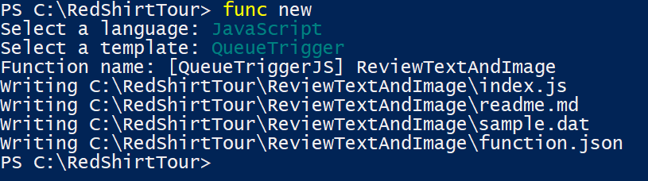
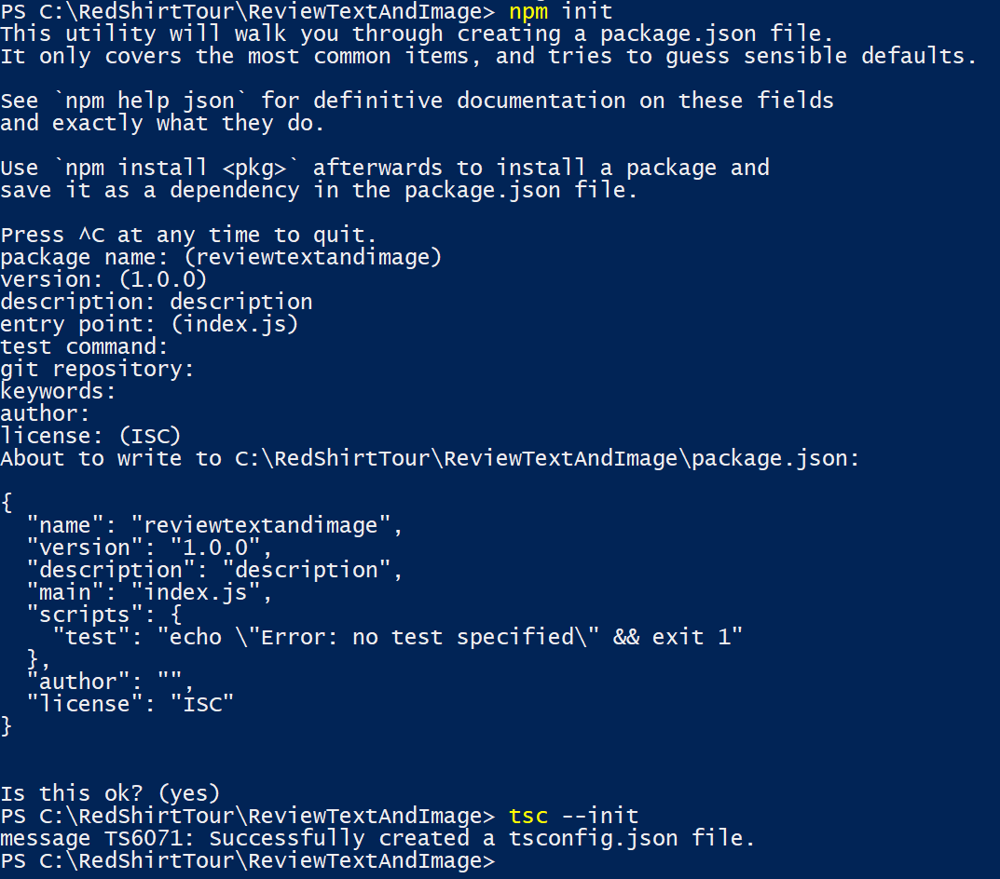
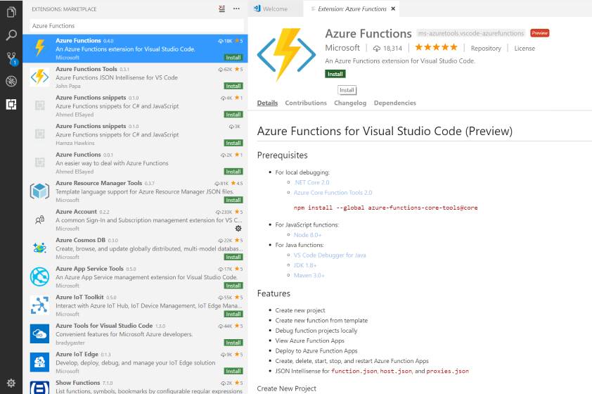

<a name="HOLTitle"></a>
# Azure Functions #

---

<a name="Overview"></a>
## Overview ##

In this lab, you will create an Azure Function to perform automated moderation of the customer reviews using Microsoft Cognitive Services.
It monitors a storage queue where the website puts alerts for my function to know that there's a new review; and binds to blob storage where the review picture is, and to a CosmosDB document where the review text and other metadata are. 
It performs then an automated analysis of the image using the Microsoft Cognitive Services [Computer Vision API](https://azure.microsoft.com/en-us/services/cognitive-services/computer-vision/) and the text using [Content Moderator API](https://azure.microsoft.com/en-us/services/cognitive-services/content-moderator/).

<a name="Objectives"></a>
### Objectives ###

In this hands-on lab, you will learn how to:

- Create an Azure Function App from Azure Functions CLI and Visual Studio Code
- Write an Azure Function that uses a queue trigger, a blob storage input and a Cosmos DB document input.
- Add application settings to an Azure Function App
- Use Microsoft Cognitive Services to analyze a text and an image and store the results in the Cosmos DB document

<a name="Prerequisites"></a>
### Prerequisites ###

The following are required to complete this hands-on lab:

- An active Microsoft Azure subscription. If you don't have one, [sign up for a free trial](http://aka.ms/WATK-FreeTrial).
- [Visual Studio Code](https://code.visualstudio.com/)
- [Node.js 8.5+](https://nodejs.org/en/)

For local debugging:
- [.NET Core 2.0 SDK](https://www.microsoft.com/net/download/core)
- Azure Core Function Tools 2.0

	```
	npm install --global azure-functions-core-tools@core
	```

---

<a name="Exercises"></a>
## Exercises ##

This hands-on lab includes the following exercises:

- [Exercise 1: Setup the environment](#Exercise1)
- [Exercise 2: Write the Azure Function](#Exercise2)

Estimated time to complete this lab: **60** minutes.

<a name="Exercise1"></a>
## Exercise 1: Setup the environment ##

In this exercise, you will create an Azure Function App using Azure Functions CLI and Visual Studio Code.

1. Create a new folder and initialize an Azure Function by doing the following from a command prompt:

	```
	mkdir redtshirtour
	cd redtshirtour
	func init
	```

**host.json** and **appsettings.json** will be created.	
	
2. Let's create a simple queue triggered function:

	```
	func new
	```

Select **JavaScript** as language, **QueueTrigger** as template and enter the name **ReviewTextAndImage** for the function name.



A JavaScript template has now been created.

3. Time to setup our TypeScript environment:

	```
	cd ReviewTextAndImage
	npm init
	tsc -- init
	mv index.js index.ts
	```

	
	
4. We are now ready to work in Visual Studio Code. Let's open up VS Code:

	```
	cd ..
	code .
	```

The next step is to write our function.

<a name="Exercise2"></a>
## Exercise 2: Write the Azure Function ##

In this exercise, you will add write TypeScript code that uses the [Computer Vision API](https://www.microsoft.com/cognitive-services/en-us/computer-vision-api) to analyze images added to the "input-images" container and the [Content Moderator API](https://azure.microsoft.com/en-us/services/cognitive-services/content-moderator/) to analyse the review text of the Cosmos DB document.

1. First of all, install the Azure Functions extension and reload VS Code.



2. Change the tsconfig.json: set **target** to *"es2015"*, uncomment the **sourcemap** line and set **lib** to *["es2015"]*. Your ts.config should like:

	```JSON
	{
	  "compilerOptions": {
	   /* Basic Options */                       
	   "target": "es2015",
	   "module": "commonjs",
	   "lib": ["es2015"],
	   "sourceMap": true
	  }
	}
	```

3. From the terminal in VS Code, execute the following commands to install the packages used by the function:

	```
	cd ReviewTextAndImage
	npm install --save-dev @types/node
	npm install axios
	```
		
4. Let's define the **trigger** and the **bindings** of the function:

> A _trigger_ defines how a function is invoked. A function must have exactly one trigger. Triggers have associated data, which is usually the payload that triggered the function.
>
> _Input and output bindings_ provide a declarative way to connect to data from within your code. Bindings are optional and a function can have multiple input and output bindings. 
>
> Source: https://docs.microsoft.com/en-us/azure/azure-functions/functions-triggers-bindings

Open function.json and replace the JSON shown in the code editor with the following JSON:

	```JSON
    {
      "disabled": false,
      "bindings": [
        {
          "name": "queueInput",
          "type": "queueTrigger",
          "direction": "in",
          "queueName": "review-queue",
          "connection": "AzureWebJobsStorage"
        },
        {
          "name": "image",
          "type": "blob",
          "dataType": "binary",
          "direction": "in",
          "path": "input-images/{BlobName}",
          "connection": "AzureWebJobsStorage"
        },
        {
          "type": "documentDB",
          "name": "inputDocumentIn",
          "direction": "in",
          "databaseName": "customerReviewData",
          "collectionName": "reviews",
          "id": "{DocumentId}",
          "partitionKey": "Reviews",
          "connection": "customerReviewDataDocDB"
        },
        {
          "type": "documentDB",
          "name": "inputDocumentOut",
          "direction": "out",
          "databaseName": "customerReviewData",
          "collectionName": "reviews",
          "createIfNotExists": false,
          "partitionKey": "Reviews",
          "connection": "customerReviewDataDocDB"
        }
      ]
    }
	```

As you can see, the function has a queue trigger, a Blob storage input, a Cosmos DB input binding and a Cosmos DB ouput binding.

5. Change the function definition in your index.ts:

	```javascript
	import axios from 'axios';

	const CONTENT_MODERATOR_API_URL: string = "https://westeurope.api.cognitive.microsoft.com/contentmoderator/moderate/v1.0/ProcessText/Screen?language=eng";
	const COMPUTER_VISION_API_URL: string = "https://westeurope.api.cognitive.microsoft.com/vision/v1.0/analyze?visualFeatures=Description,Tags&language=en";
	
	export async function run(context: any, queueInput: any, image: any, inputDocumentIn: any) {
	}
	```
	
6. Let's write a JavaScript function to review the text of the review:
	```javascript
	async function passesTextModeratorAsync(document: any): Promise<boolean> {
    if (document.ReviewText == null) {
        return true;
    }

    let config: any = {
        headers: {
            "Ocp-Apim-Subscription-Key": process.env["ContentModerationApiKey"],
            "Content-Type": "text/plain"
        }
    };

    let content: string = document.ReviewText;
    let result = await axios.post(
        CONTENT_MODERATOR_API_URL,
        content,
        config);

    // If we have Terms in result it failed the moderation (Terms will have the bad terms)
    return result.data.Terms == null;
	}
	```