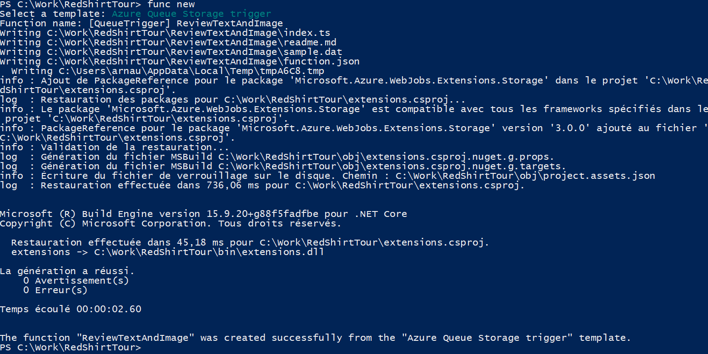
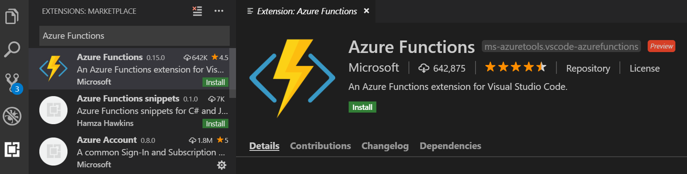
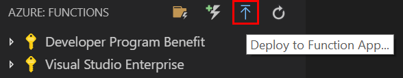

<a name="HOLTitle"></a>
# Azure Functions #

<a name="Overview"></a>
## Overview ##

In this lab, you will create an Azure Function to perform automated moderation of customer reviews using Microsoft Cognitive Services.
The function monitors a storage queue where the website puts alerts for my function to know that there's a new review; and binds to blob storage where the review picture is, and to a CosmosDB document where the review text and other metadata are. 
It performs then an automated analysis of the image using the Microsoft Cognitive Services [Computer Vision API](https://azure.microsoft.com/en-us/services/cognitive-services/computer-vision/) and the text using [Content Moderator API](https://azure.microsoft.com/en-us/services/cognitive-services/content-moderator/).

<a name="Objectives"></a>
### Objectives ###

In this hands-on lab, you will learn how to:

- Create an Azure Function App from Azure Functions CLI and Visual Studio Code
- Write an Azure Function that uses a queue trigger, a blob storage input and a Cosmos DB document input.
- Add application settings to an Azure Function App
- Use Microsoft Cognitive Services to analyze a text and an image and store the results in a Cosmos DB document

<a name="Prerequisites"></a>
### Prerequisites ###

In order to complete this hands-on-lab, it is required to have:

- An active Microsoft Azure subscription. If you don't have one, [sign up for a free trial](http://aka.ms/WATK-FreeTrial).
- [Visual Studio Code](https://code.visualstudio.com/)
- [Node.js 8.5+](https://nodejs.org/en/)

For local debugging:
- [.NET Core 2.x SDK](https://www.microsoft.com/net/download/core)
- Azure Core Function Tools 2.x

	```
	npm install -g azure-functions-core-tools@core
	```

---

<a name="Exercises"></a>
## Exercises ##

This hands-on lab includes the following exercises:

- [Exercise 1: Setup the environment](#Exercise1)
- [Exercise 2: Write the Azure Function](#Exercise2)
- [Exercise 3: Deploy the Function app](#Exercise3)

Estimated time to complete this lab: **60** minutes.

<a name="Exercise1"></a>
## Exercise 1: Setup the environment ##

In this exercise, you will create an Azure Function App using Azure Functions CLI and Visual Studio Code.

1. Create a new folder and initialize an Azure Function by doing the following from a command prompt:

	```
	mkdir RedShirtTour
	cd RedShirtTour
	func init
	```

Choose **node** as worker runtime and then **typescript** as language. **host.json**, **local.settings.json**, **package.json** and **tsconfig.json** will be created.	
	
2. Let's create a simple queue triggered function:

   ```
   func new
   ```

   Choose **Azure Queue Storage trigger** as template and enter the name **ReviewTextAndImage** for the function name.
   
   
   
   A TypeScript template has now been created.
	
3. We are now ready to work in Visual Studio Code. Let's open up VS Code:

	```
	code .
	```

The next step is to write our function.

<a name="Exercise2"></a>
## Exercise 2: Write the Azure Function ##

In this exercise, you will write TypeScript code that uses the [Computer Vision API](https://www.microsoft.com/cognitive-services/en-us/computer-vision-api) to analyze images added to the "input-images" container and the [Content Moderator API](https://azure.microsoft.com/en-us/services/cognitive-services/content-moderator/) to analyse the review text of the Cosmos DB document.

1. First of all, install the Azure Functions extension and reload VS Code.

   

1. From the terminal in VS Code, execute the following commands to install the packages used by the function:

	```
	cd ReviewTextAndImage
	npm install --save-dev @types/node
	npm install axios
	```
		
1. Let's define the **trigger** and the **bindings** of the function:

   > A _trigger_ defines how a function is invoked. A function must have exactly one trigger. Triggers have associated data, which is usually the payload that triggered the function.
   >
   > _Input and output bindings_ provide a declarative way to connect to data from within your code. Bindings are optional and a function can have multiple input and output bindings. 
   >
   > Source: https://docs.microsoft.com/en-us/azure/azure-functions/functions-triggers-bindings

   Open function.json and replace the JSON shown in the code editor with the following JSON:
   
   ```json
   {
     "disabled": false,
     "bindings": [
   	{
   	  "name": "queueInput",
   	  "type": "queueTrigger",
   	  "direction": "in",
   	  "queueName": "review-queue",
   	  "connection": "AzureWebJobsStorage"
   	},
   	{
   	  "name": "image",
   	  "type": "blob",
   	  "dataType": "binary",
   	  "direction": "in",
   	  "path": "input-images/{BlobName}",
   	  "connection": "AzureWebJobsStorage"
   	},
   	{
   	  "type": "cosmosDB",
   	  "name": "inputDocumentIn",
   	  "direction": "in",
   	  "databaseName": "customerReviewData",
   	  "collectionName": "reviews",
   	  "id": "{DocumentId}",
   	  "partitionKey": "Reviews",
   	  "connectionStringSetting": "customerReviewDataDocDB"
   	},
   	{
   	  "type": "cosmosDB",
   	  "name": "inputDocumentOut",
   	  "direction": "out",
   	  "databaseName": "customerReviewData",
   	  "collectionName": "reviews",
   	  "createIfNotExists": false,
   	  "partitionKey": "Reviews",
   	  "connectionStringSetting": "customerReviewDataDocDB"
   	}
     ],
     "scriptFile": "../dist/ReviewTextAndImage/index.js"
   }
   ```

   As you can see, the function has a queue trigger, a Blob storage input, a Cosmos DB input binding and a Cosmos DB ouput binding.

1. Change the function definition in your index.ts:

	```javascript
	import { AzureFunction, Context } from "@azure/functions"
	import axios from 'axios';

	const CONTENT_MODERATOR_API_URL: string = "https://westeurope.api.cognitive.microsoft.com/contentmoderator/moderate/v1.0/ProcessText/Screen?language=eng";
	const COMPUTER_VISION_API_URL: string = "https://westeurope.api.cognitive.microsoft.com/vision/v1.0/analyze?visualFeatures=Description,Tags&language=en";
	
	const queueTrigger: AzureFunction = async function (context: Context, myQueueItem: string, image: any, inputDocumentIn: any): Promise<void> {
	}
	
	export default queueTrigger;
	```
	
1. Let's write a function to review the text of the review:

	```javascript
	async function passesTextModeratorAsync(document: any): Promise<boolean> {
		if (document.ReviewText == null) {
			return true;
		}

		let config: any = {
			headers: {
				"Ocp-Apim-Subscription-Key": process.env["ContentModerationApiKey"],
				"Content-Type": "text/plain"
			}
		};

		let content: string = document.ReviewText;
		let result = await axios.post(
			CONTENT_MODERATOR_API_URL,
			content,
			config);

		// If we have Terms in result it failed the moderation (Terms will have the bad terms)
		return result.data.Terms == null;
	}
	```
	
1. Now, call the previous function from the _run_ function:

	```javascript
	let passesText = await passesTextModeratorAsync(inputDocumentIn);
	```
	
1. Text has been reviewed. Time to analyze the image now. Add the following function to your code editor:

	```javascript
	async function analyzeImage(image: any): Promise<[string, boolean]> {
		let config: any = {
			processData: false,
			headers: {
				"Ocp-Apim-Subscription-Key": process.env["MicrosoftVisionApiKey"],
				"Content-Type": "application/octet-stream"
			}
		};

		let result = await axios.post(
			COMPUTER_VISION_API_URL,
			image,
			config);

		let caption = result.data.description.captions[0].text;
		let containsCat = (<Array<Tag>>result.data.tags).some(item => {
			return item.name.indexOf("cat") !== -1;
		});

		return [caption, containsCat];
	}

	interface Tag {
		confidence: number,
		name: string
	}
	```
	
1. Call it from the _run_ function. It will be slightly different as the Cosmos DB document needs to be updated:

	```javascript
    context.bindings.inputDocumentOut = inputDocumentIn;

    let imageInformation = await analyzeImage(image);

    context.bindings.inputDocumentOut.IsApproved = imageInformation[1] && passesText;
    context.bindings.inputDocumentOut.Caption = imageInformation[0];
	```
	
   >First, a copy of the input document is created, then the function to analyze the image is called and finally certain properties of our document are updated.

You are done with the coding part of this lab!

<a name="Exercise3"></a>
## Exercise 3: Deploy the Function app ##

1. First of all, run `npm install` to install dev dependencies.

1. To build your function app, run `npm run build`. To prepare it for deployment, use `npm run build:production`.

1. From VS Code, in the Azure: functions section, press the following button to deploy the function app:

   	

   Choose a folder on your local system, then choose an Azure subscription and select a function app (or create a new one).

1. Add the following settings in the Application Settings of your function app:

* **AzureWebJobsStorage**: Connection string to the storage account
* **ContentModerationApiKey**: Content Moderation Api Key 
* **MicrosoftVisionApiKey**: Computer Vision Api Key
* **customerReviewDataDocDB**: Cosmos DB connection string


The Azure Function has now been published and configured. Let's test it out!

In your browser, open a new tab and go to the Azure Portal.
Go to the function app you have created and open your function to see the logs.

Open another tab and navigate to the website you have deployed at the beginning of this hands-on-lab. Select **Reviews** in the menu, then press the button **add picture**. Submit a new picture by pressing **+ Image** and then the button **Create**.

Have a look at the logs of your function, you should see **Function started** and also **Function completed**. Depending on the photo you submitted, you should now see it either in **Approved** or **Rejected** in the website.
