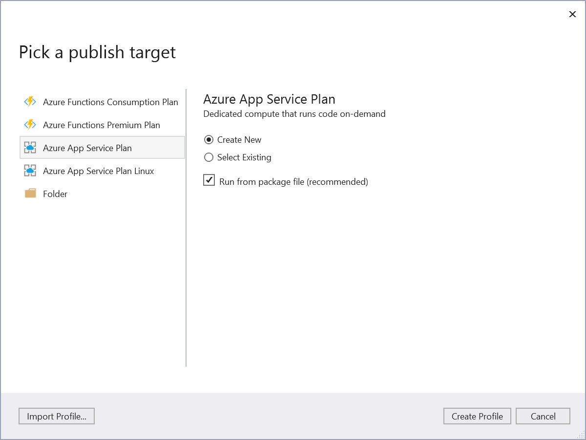

<a name="HOLTitle"></a>
# Azure Functions #

---

<a name="Overview"></a>
## Overview ##

In this lab, you will create an Azure Function to perform automated moderation of customer reviews using Microsoft Cognitive Services.
The function monitors a storage queue where the website puts alerts for my function to know that there's a new review; and binds to blob storage where the review picture is, and to a CosmosDB document where the review text and other metadata are. 
It performs then an automated analysis of the image using the Microsoft Cognitive Services [Computer Vision API](https://azure.microsoft.com/en-us/services/cognitive-services/computer-vision/) and the text using [Content Moderator API](https://azure.microsoft.com/en-us/services/cognitive-services/content-moderator/).

<a name="Objectives"></a>
### Objectives ###

In this hands-on lab, you will learn how to:

- Create an Azure Function App from Visual Studio 2017
- Write an Azure Function that uses a queue trigger, a blob storage input and a Cosmos DB document input.
- Add application settings to an Azure Function App
- Use Microsoft Cognitive Services to analyze a text and an image and store the results in a Cosmos DB document

<a name="Prerequisites"></a>
### Prerequisites ###

In order to complete this hands-on-lab, it is required to have:

- An active Microsoft Azure subscription. If you don't have one, [sign up for a free trial](http://aka.ms/WATK-FreeTrial).
- [Visual Studio 2017 15.3 (or later)](https://www.visualstudio.com/fr/downloads/)
- Visual Studio 2017 Tools for Azure Functions (available by installing the "Azure development" workload)

---

<a name="Exercises"></a>
## Exercises ##

This hands-on lab includes the following exercises:

- [Exercise 1: Write the Azure Function](#Exercise1)
- [Exercise 2: Test the function locally](#Exercise2)
- [Exercise 3: Publish the Azure Function](#Exercise3)

Estimated time to complete this lab: **60** minutes.

<a name="Exercise1"></a>
## Exercise 1: Write the Azure Function ##

In this exercise, you will write C# code that uses the [Computer Vision API](https://www.microsoft.com/cognitive-services/en-us/computer-vision-api) to analyze images added to the "input-images" container and the [Content Moderator API](https://azure.microsoft.com/en-us/services/cognitive-services/content-moderator/) to analyse the review text of the Cosmos DB document.

1. From VS2017, create a new project by choosing **File -> New Project**, and the **Azure Functions** project type. Call it ContentModeratorFunction.


2. On the template dialog, configure your function as followed:
- Keep **Azure Functions v1 (.NET Framework)** in the dropdown list
- Select **Queue Trigger**
- Set the **Storage Account** to the one you have created at the beginning of this hands-on-lab
- Set the **Path** to **review-queue**


This generates a new project which contains the following files:
- host.json enables configuring the function host
- local.settings.json which stores setting information such as connection strings used for running the function on the development machine
- a class that contains boilerplate code

3. Rename the .cs file to AnalyzeImage.cs

4. The **FunctionName** attribute on the method sets the name of the function. Change it to **ReviewImageAndText**.

5. Install the NuGet package **Microsoft.Azure.WebJobs.Extensions.DocumentDB**
	```
	PM> Install-Package Microsoft.Azure.WebJobs.Extensions.DocumentDB
	```

6. Let's define the **trigger** and the **bindings** of the function. Change the content of the .cs file:

> A _trigger_ defines how a function is invoked. A function must have exactly one trigger. Triggers have associated data, which is usually the payload that triggered the function.
>
> _Input and output bindings_ provide a declarative way to connect to data from within your code. Bindings are optional and a function can have multiple input and output bindings. 
>
> Source: https://docs.microsoft.com/en-us/azure/azure-functions/functions-triggers-bindings

	```cs
	using System;
	using System.IO;
	using System.Linq;
	using System.Net.Http;
	using System.Threading.Tasks;
	using Microsoft.Azure.WebJobs;

	namespace ContentModeratorFunction
	{
		public static class AnalyzeImage
		{
			private static readonly string ContentModeratorApiUri = $"https://{Environment.GetEnvironmentVariable("AssetsLocation")}.api.cognitive.microsoft.com/contentmoderator/moderate/v1.0/ProcessText/Screen?language=eng";
			private static readonly string ComputerVisionApiRoot = $"https://{Environment.GetEnvironmentVariable("AssetsLocation")}.api.cognitive.microsoft.com/vision/v1.0";

			private static readonly string SearchTag = "cat";
			
			[FunctionName("ReviewImageAndText")]
			public static async Task Run(
				[QueueTrigger("review-queue")] ReviewRequestItem queueInput,
				[Blob("input-images/{BlobName}", FileAccess.Read)] Stream image,
				[DocumentDB("customerReviewData", "reviews", Id = "{DocumentId}", PartitionKey = "Reviews", ConnectionStringSetting = "customerReviewDataDocDB")] dynamic inputDocument)
			{

			}

			public class ReviewRequestItem
			{
				public string DocumentId { get; set; }
				public string BlobName { get; set; }
			}
		}
	}
	```
	
As you can see, the function has a queue trigger, a Blob storage input and a Cosmos DB input binding.
	
7. Let's write a C# method to review the text of the review:

	```cs
	public static async Task<bool> PassesTextModeratorAsync(dynamic document)
	{
		if (document.ReviewText == null)
		{
			return true;
		}

		using (HttpClient httpClient = new HttpClient())
		{
			httpClient.DefaultRequestHeaders.Add("Ocp-Apim-Subscription-Key", Environment.GetEnvironmentVariable("ContentModerationApiKey"));

			var stringContent = new StringContent(document.ReviewText);
			var response = await httpClient.PostAsync(ContentModeratorApiUri, stringContent);

			response.EnsureSuccessStatusCode();

			JObject data = JObject.Parse(await response.Content.ReadAsStringAsync());
			JToken token = data["Terms"];

			//If we have Terms in result it failed the moderation (Terms will have the bad terms)
			return !token.HasValues;
		}
	}
	```
	
8. Now, call the previous method from the _Run_ method:

	```cs
	bool passesText = await PassesTextModeratorAsync(inputDocument);
	```
	
9. Text has been reviewed. Time to analyze the image now. First add the NuGet package **Microsoft.ProjectOxford.Vision** and then add the following method to your code editor:

	```cs
	public static async Task<(bool, string)> PassesImageModerationAsync(Stream image)
	{
		var client = new VisionServiceClient(Environment.GetEnvironmentVariable("MicrosoftVisionApiKey"), ComputerVisionApiRoot);
		var result = await client.AnalyzeImageAsync(image, new[] { VisualFeature.Description });

		bool containsCat = result.Description.Tags.Take(5).Contains(SearchTag);
		string message = result.Description?.Captions.FirstOrDefault()?.Text;
		return (containsCat, message);
	}
	```
	
10. Call it from the _Run_ method. It will be slightly different as the Cosmos DB document needs to be updated:

	```cs
	(bool containsCat, string caption) = await PassesImageModerationAsync(image);
	
	inputDocument.IsApproved = containsCat && passesText;
	inputDocument.Caption = caption;
	```
	
>The function to analyze the image is called and certain properties of our document are updated.

You are done with the coding part of this lab!

<a name="Exercise2"></a>
## Exercise 2: Test the function locally ##

1. Open local.settings.json and replace the content of the file with the following JSON:

	```json
	{
	  "IsEncrypted": false,
	  "Values": {
		"AzureWebJobsStorage": "__AzureWebJobsStorage__",
		"MicrosoftVisionApiKey": "__MicrosoftVisionApiKey__",
		"ContentModerationApiKey": "__ContentModerationApiKey__",
		"AssetsLocation": "__AssetsLocation__",
		"customerReviewDataDocDB": "__customerReviewDataDocDB__",
	  },
	  "ConnectionStrings": {}
	}
	```
	
2. All values must be updated before you build and test your function:

* **AzureWebJobsStorage**: Connection string to the storage account
* **MicrosoftVisionApiKey**: Computer Vision Api Key
* **ContentModerationApiKey**: Content Moderation Api Key 
* **AssetsLocation**: Location of the Cognitive Services (westeurope)
* **customerReviewDataDocDB**: Cosmos DB connection string

3. Press F5 to test your function. If prompted, accept the request from Visual Studio to download and install Azure Functions Core (CLI) tools.

4. Navigate to the website you have deployed at the beginning of this hands-on-lab. Select **Reviews** in the menu, then press the button **add picture**. Submit a new picture by pressing **+ Image** and then the button **Create**.
Have a look at the logs of your function in the command prompt, you should see **Function started** and also **Function completed**. Depending on the photo you submitted, you should now see it either in **Approved** or **Rejected** in the website.

<a name="Exercise3"></a>
## Exercise 3: Publish the Azure Function ##

1. In **Solution Explorer**, right-click the project and select **Publish**. Choose **Create New** and then **Publish**:

	

2. In the Create App Service dialog, fill in all information and click **Create** to create a function app and related resources in Azure with these settings and deploy your function project code.

3. After the deployment is complete, go to the **Azure Portal**, go to the function app which has just been created and add the following settings in the Application Settings:

* **AzureWebJobsStorage**: Connection string to the storage account
* **ContentModerationApiKey**: Content Moderation Api Key 
* **MicrosoftVisionApiKey**: Computer Vision Api Key
* **customerReviewDataDocDB**: Cosmos DB connection string


The Azure Function has now been published and configured!
