
# Provision Customer Reviews Services and Reset datas 

---

## Overview ##

Visual Studio Team Services (VSTS) helps helps automate ans secure the delivery pipeline of your applications. In lab 00, we used the intern deployment engine tool of Azure Kudu. It's a great tool to start with but comes with limitations. 

In this lab, you will create a build pipeline to automatically build, test, package and deploy the Azure Function that check Image and moderate text for the CustomerReviews site. And use Application Insights to follow the health of solution and results of the reviews.

### Objectives ###

In this hands-on lab, you will learn how to:

- Create a Continuous Deployment of an Azure Function
- Use a custom telemetry for Application Insights 

### Prerequisites ###

The following are required to complete this hands-on lab:

- An active Microsoft Azure subscription. If you don't have one, [sign up for a free trial](http://aka.ms/WATK-FreeTrial).
- An active GitHub account. If you don't have one, [sign up for free ](https://github.com/join). 
- Execute succesfully the [lab 00](../00%20-%20Provision%20resources%20and%20Reset) .

---

## Exercises ##

This hands-on lab includes the following exercises:

- [Exercise 1: Create an VSTS account and Project](#Exercise1)
- [Exercise 2: Fork GitHub repository and create a PAT](#Exercise2)
- [Exercise 3: Create a pipeline to Continuous Delivery of an Azure Function](#Exercise3)
- [Exercise 4: Create custom query and use dashboard of Application Insights](#Exercise4)

Estimated time to complete this lab: **30** minutes.

## Exercise 1: Create an VSTS account and Project ##

The first step in creting a continuous pipeline is to create an VSTS account and a Team Project. In this exercise, you will create the a new account and through Azure Portal.

1. Use an existing VSTS account or [create a new one](https://www.visualstudio.com/en-us/docs/setup-admin/team-services/sign-up-for-visual-studio-team-services)

2. Open this link to create a VSTS account : https://go.microsoft.com/fwlink/?LinkId=307137 , and login with the sam Microsoft account than in Azure portal.

    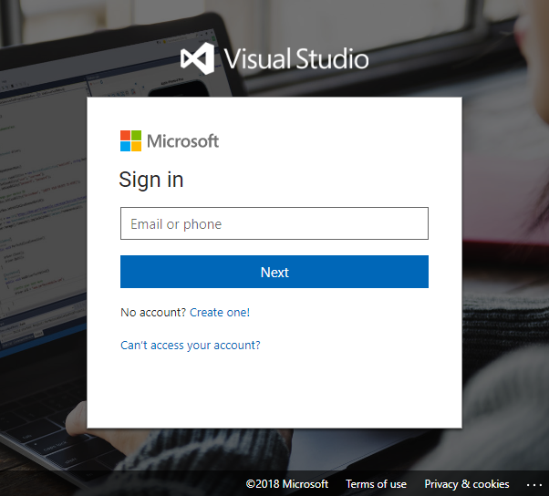

3. Enter a name for your account, and then click on **Continue**

    > if you want to change the de deployment region or the name of team project created, click on **Change details** .

    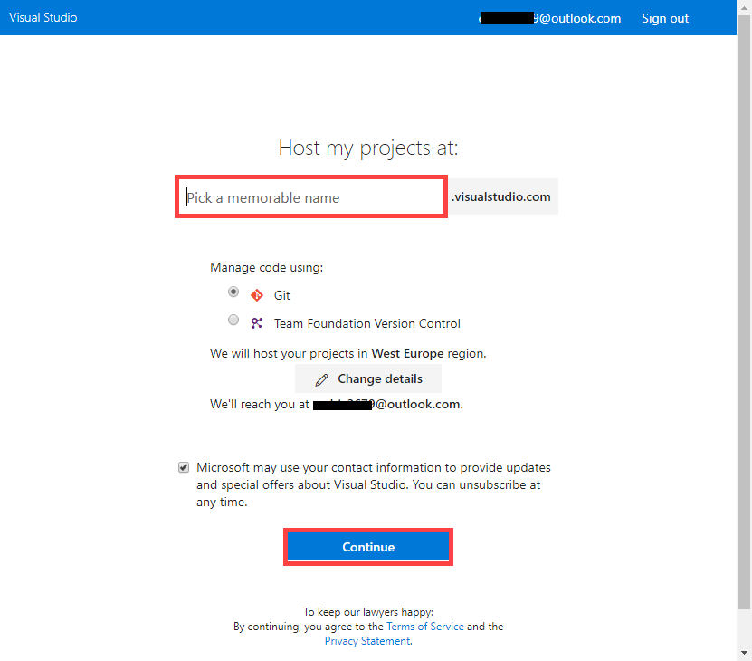

4. Check you project MyFirstProject is created. 

    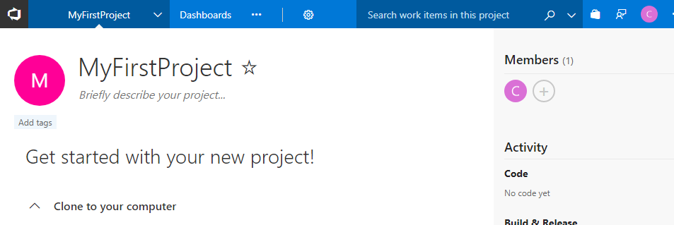

Now you have a team project ready to help you Code, Build, Release, Test your apps. Next, you need your own Github repository.

## Exercise 2: Fork GitHub repository and create a PAT ##

Once you have created an VSTS account and team project, you can build a project from any git repository. To enable continuous trigger for each commit on GitHUb repository, you need to be an owner on the repository. In this exercise, you will fork this repository to your account on which you will be an owner. 

1. Open the repository root on new tab https://github.com/azugfr/functions-customer-reviews, and then click on **Fork** or **Sign in**

    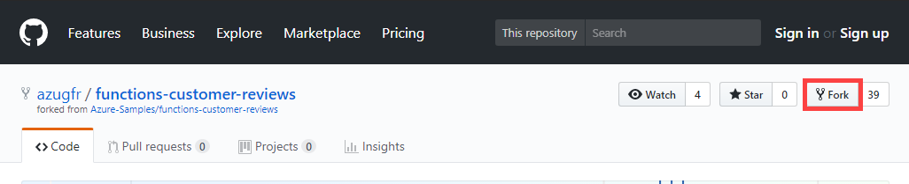

2. Click on Enter your **username** and **password**, and then click **Sign in**  

    >  If you don't have an GitHub account, click on **Create an account** to create one

    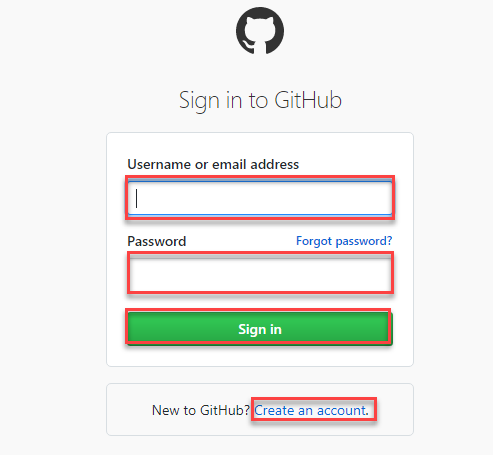

3. If you signed in, you need to click a second time on **Fork**

    

4. Click on **Clone an download**. Take note of your Git Url, you will need it in [Exercise 3](*Exercise3)

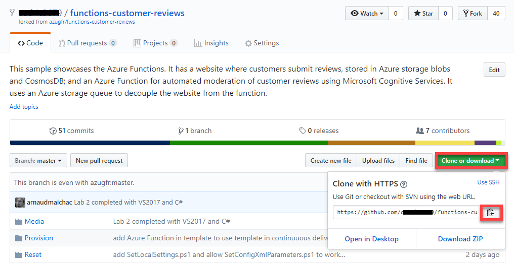

The forked GitHub repo allows you to commit your changes. The next step is to add an build pipeline to integrate these changes.

## Exercise 3: Create a pipeline to set Continuous Delivery of an Azure Function ##

The VSTS team project you created in [Exercise 1](#Exercise1) and the GitHub repo you forked in [Exercise 2](#Exercise2) will helps you build, test and deploy the Azure Function in [ContentModerator solution](../Source/csharp/ContentModerator.sln) to the Azure Function App you provisionned in [lab 00](../00 - Provision resources and Reset). In this exercise, you will create a minimal pipeline with a build and a release definitions to continuously deploy your change on the Azure Function.

1. Navigate to your VSTS Team project, and click on **Build & Release** > **Builds**

   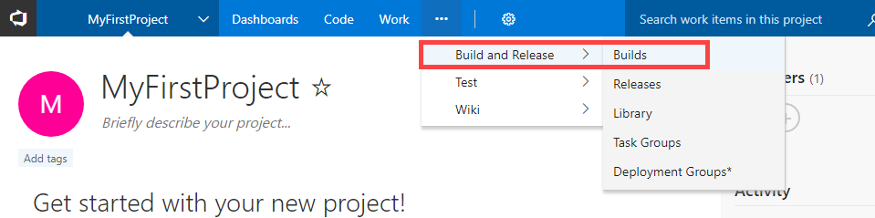

2. Click **+New** button 

3. Select **ASP.NET**, click on **Apply**

   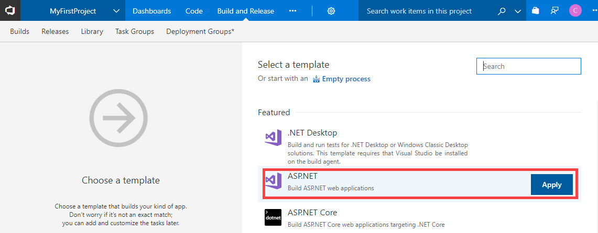

4. Click on **Get sources**, Select **GitHub**, enter connection of your fork GitHub repository created in [exercise 2](*Exercise2), and then click on **Authorize using OAuth** 

   > if nothing happen, your browser may blocking popup windows, authorize them to continue. And click on **Authorize using OAuth**

   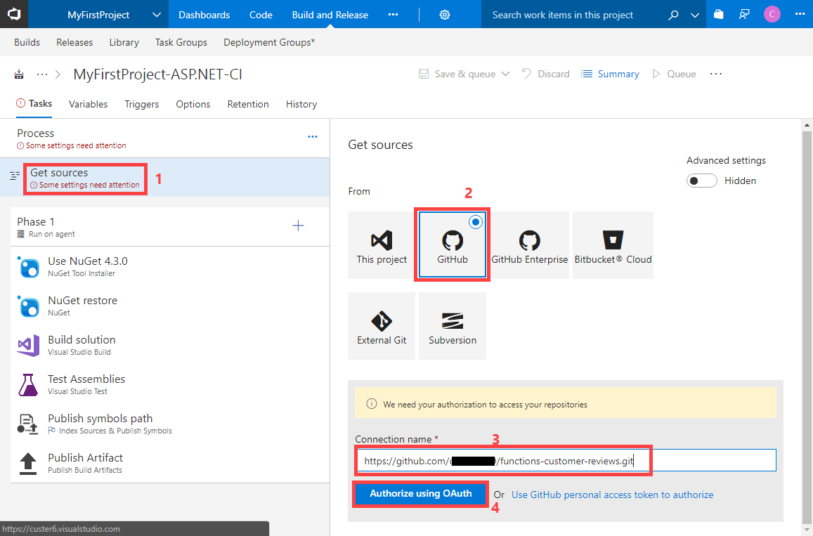

5. Click on **Authorize vsonline**

   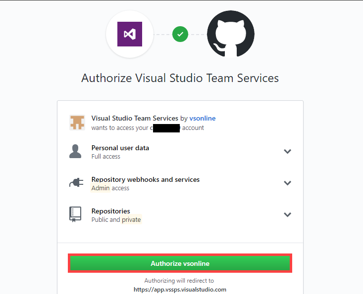

6. Return to the Build Definiition, click on **Triggers**, and then select **Enable continuous integration** 

   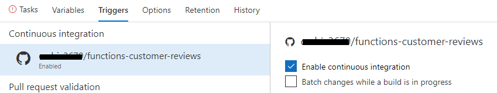

7. Click on **Tasks**, and then click **Process** , and enter `**\ContentModerator.sln` in **Path to solution or packages.config**

   > if **Agent queue** is not set, choose `Hosted VS2017`

   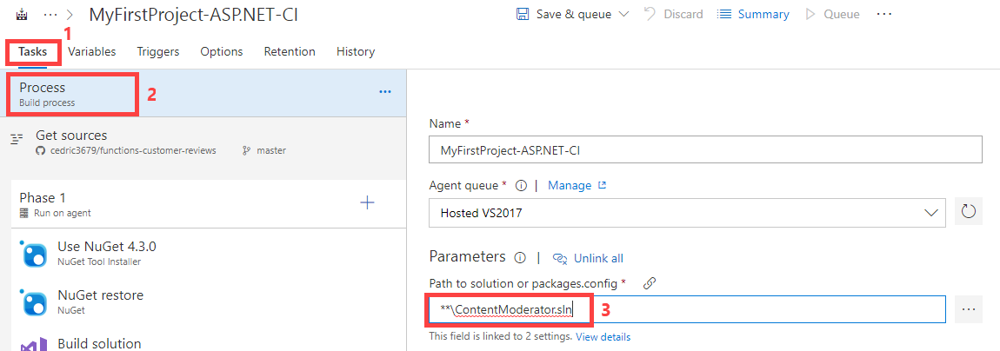

8. Click Save & queue > **Save**, and then **Save**

   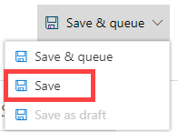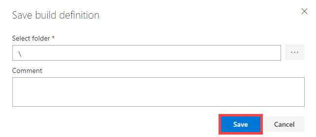

9. Click on **Releases**, and then **+ New definition **

   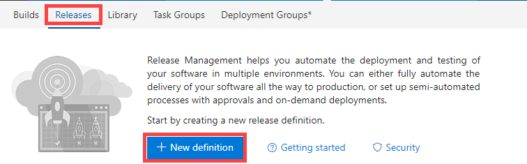

10. Select **Azure App Service Deployment**, and click **Apply**

    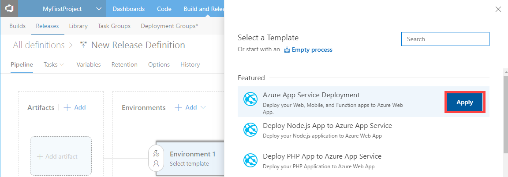 

11. Enter `Dev` in **Environment**

    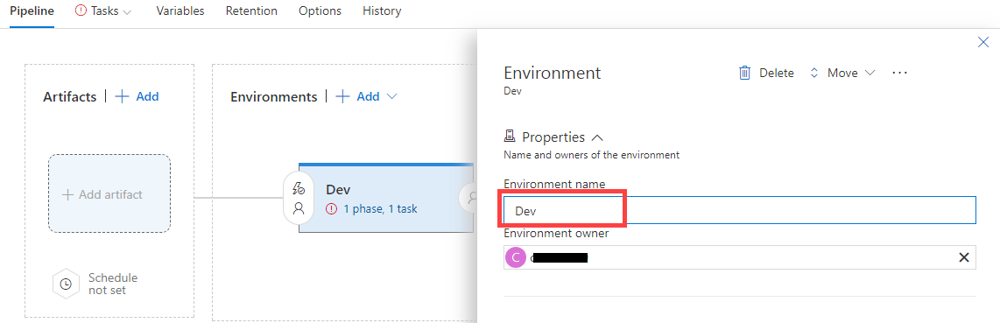

12. Click on **Add artifact**, select the build you just created in **Source**, and then click **Add**

    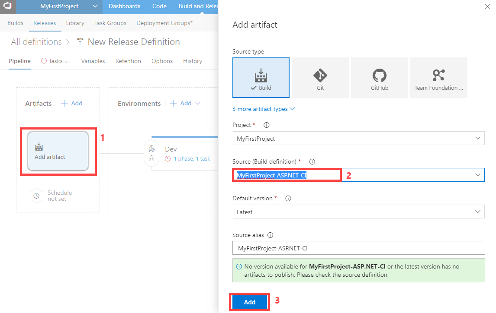

13. Click on **Continuous deployment trigger**, swith On **Enabled**, and click on **1 phase, 1 task** link 

    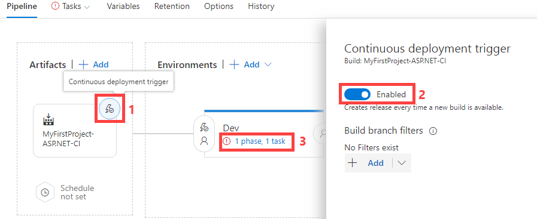

14. Click **Tasks**, click **+ New** on the right of Azure Subscription 

    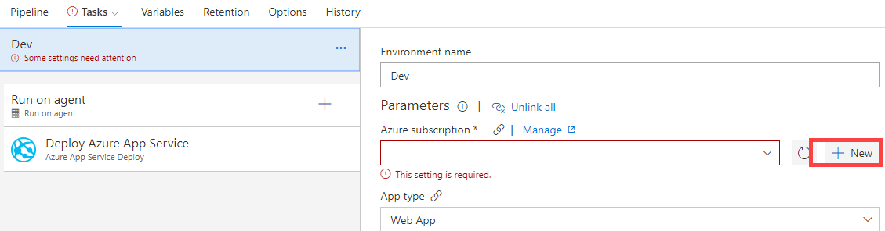

15. Click

    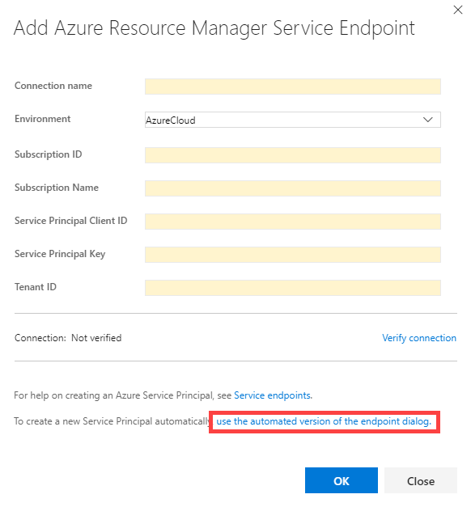

16. Enter `AzureFunction` in **Name**, and click **OK**

    > if dropdown Subscrition is empty if you do not see the subcription used for [lab 00](../00%20-%20Provision%20resources%20and%20Reset ), your vsts account is not linked to the Azure subscription. You can [link your VSTS account to Azure subscription](https://docs.microsoft.com/en-us/vsts/billing/set-up-billing-for-your-account-vs) 
    > Or use preceding dialog and follow instructions of creating a [service principal](https://docs.microsoft.com/en-us/azure/azure-resource-manager/resource-group-create-service-principal-portal) and [Service endpoints](https://go.microsoft.com/fwlink/?LinkID=623000&clcid=0x409). Add `Contributor` role to your Service principal on Azure Function App

    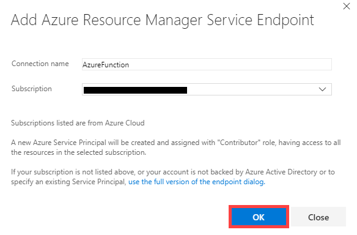

17.  Click **Authorize** 

    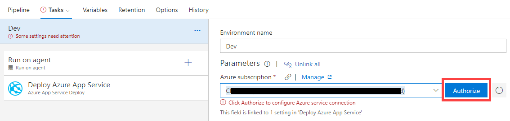

    > A login popup may appear. login to proceed

18. Select **Function App** in **App type** dropdown, select your `<unique_name>function` in **App service name** dropdown

    > you may have to refresh **App service name** after selecting **App type**

    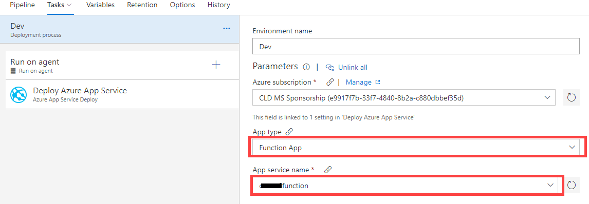

19. Click **Save**, and then **OK**

    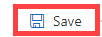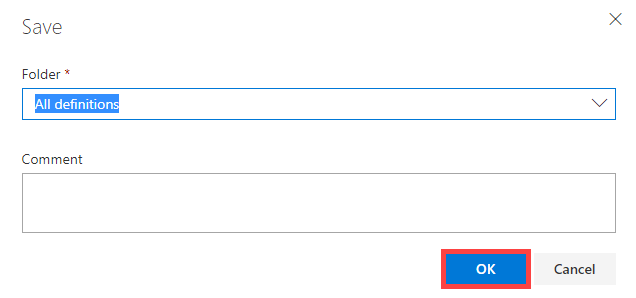

20. Click **Builds**, and click on **...**, click  **Queue new build...**, and click **Queue**

    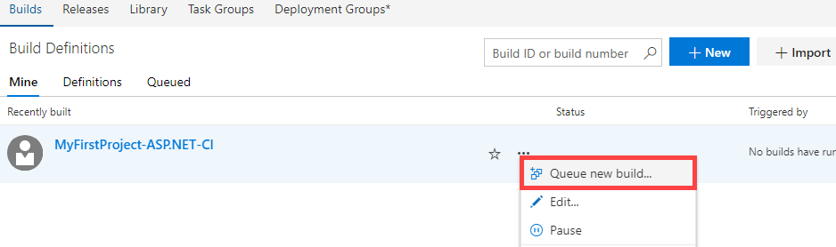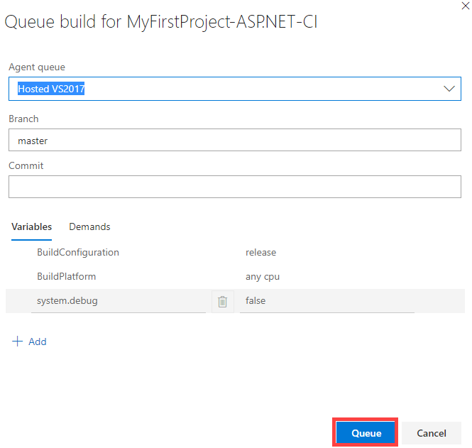

21. Open Build build 

    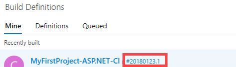

    > When the Build has succeeded

    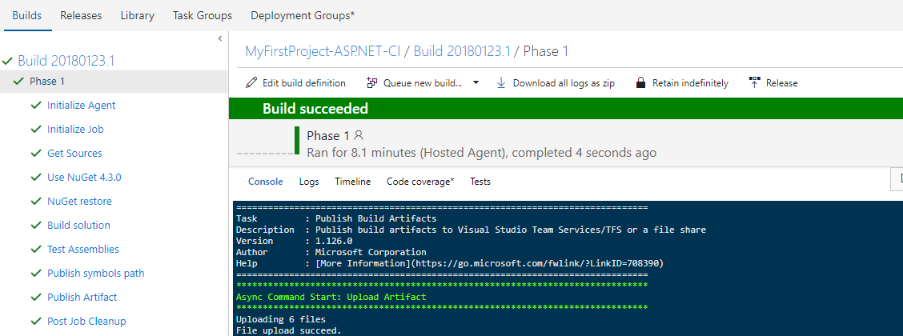

22. Click on **Releases**, and click **...** , and **Open**

    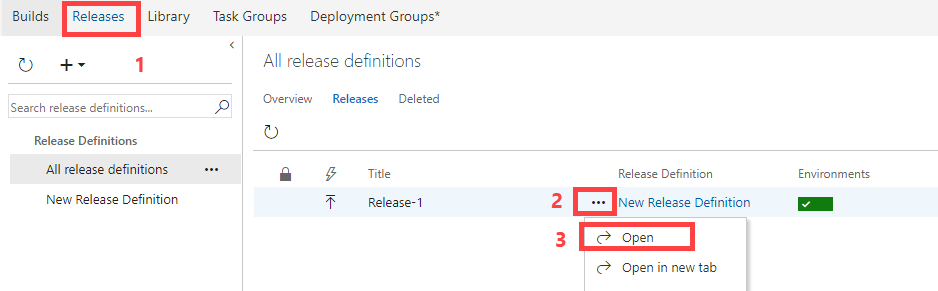

    > the release has been automatically triggered on `Dev` environment and hopefully succeeded

    ​

    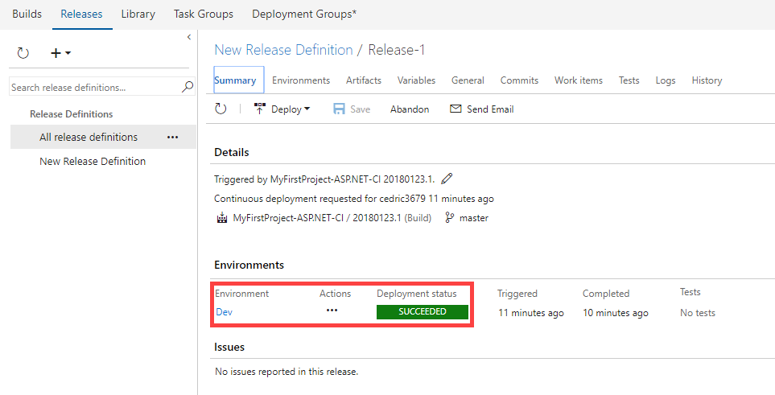

    You have now a minimal pipeline to update your Azure Function. You can test your function work by adding some image to CustomerReviews site.

### (Optional) Expand build to run tests 

You can expand the build to also run tests

1. Click **Tasks**, and then **Test Assemblies**, and enter `**\$(BuildConfiguration)\**\*test*.dll` in **Test Assemblies**

2. [Make sure you have Colin's ALM Corner Build & Release Tools installed on your VSTS account](https://marketplace.visualstudio.com/items?itemName=colinsalmcorner.colinsalmcorner-buildtasks)

3. Create the following variables for your new build definitions:

   - AzureWebJobsStorage
   - MicrosoftVisionApiKey
   - ContentModerationApiKey
   - customerReviewDataDocDB
   - APPINSIGHTS_INSTRUMENTATIONKEY

4. Add the `Replace Tokens` task between the `Build Solution` and `Test Assemblies` tasks. This task will replace the values in `local.settings.json` with the values in the variables. Configure the settings in this task with the following values:

   - sourcePath: ContentModeratorFunction/bin/$(BuildConfiguration)

   - filePattern: local.settings.json

   - tokenRegex: __(\\w+)__

   - Queue a new build run - the build summary should show the two tests passed:

     

###  (Advanced) Expand pipeline to automate resource deployment

You can expand the release to also create or update all the assets before deploying Azure Function App.

1. In Build definition, add a new `Publish Build Artifacts` task. Set it to copy the `template.json` and `parameters.json` available in `../Provision/assets`
2. In Release definition, add a new `Azure Resource Group Deployment`task. Set it to update your assets as detailed in [automate resource deployment of Azure Function](https://docs.microsoft.com/en-us/azure/azure-functions/functions-infrastructure-as-code)

The work of writing, configuring and deploy the Azure Function is complete. Now comes the fun part: testing it out and monitor it.

## Exercise 4: Create custom query and use dashboard of Application Insights ##

Your function is configured to listen for changes to the blob container named "uploaded". Each time an image appears in the container, the function executes and passes the image to the Computer Vision API for analysis. To test the function, you simply upload images to the CustomerReviews site. In this exercise, you will explore how Application Insights custom telemetry can be surfaced on Azure Dashboard along with overall telemetry from the demo website.

| Screen                         | Steps                                    | Script                                   |
| ------------------------------ | ---------------------------------------- | ---------------------------------------- |
|                                | Point out in the code the ``EmitCustomTelemetry`` call.
Show the ``EmitCustomTelemetry`` method code.
Change to Azure Portal tab in the browser | In addition to the best development tooling and great integration with Visual Studio Team Services, we can take advantage of Application Insights to easily build custom telemetry into your application. You will see that with a few lines of code I am collecting and storing application telemetry for deep insights and analysis. So let's switch to the Azure Portal to see this in action against our production website. |
|  | (in the shared Reviews Insights dashboard) Mouse over the donut wheel.
Hover over a couple of areas of the donut.
Hover over the application map.
Click on edit query in the donut or tab to already opened tab | When we go to the Azure portal we have rich visualizations and deep insights about how your app and your function are performing in a shared dashboard used by my team. You can see how many Reviews have been approved or rejected and why. You can also see how many calls are being made to my site, Azure Function, and their dependencies, and the latency of these calls. And if you need to you can drill into the specifics of your telemetry using Application Insights Analytics |
|  | Change the type of query result to ``barchart``
Click Go to run the query again. | Here you can drill in to individual requests, aggregate your results in a different way. You can change the view type and re-run the query. You can export it to our Azure Portal dashboard as you saw, or use this as a source in Power BI. |

You can continue to explore Application Insights and change the dashboard.

## Summary ##

In this hands-on lab you learned how to:

- Create a VSTS account and a new Team project
- Create a fork of a Github repository and a new PAT to access this repository
- Create a new pipeline with a Build and a Release definitions to continuously deliver an Azure Function
- Use Application Insights to follow solution health and follow your custom metrics.

This is just one example of how you can leverage VSTS and Application Insights. Experiment with other application deployment, you may want to add CustomerReviews site alonside the Azure Function. You could also leverage Azure Web apps capabilities like Slots to launch integrations tests before, or add an intermediate environment before production one like in this [blog post](https://blogs.msdn.microsoft.com/visualstudioalmrangers/2017/10/04/azure-function-ci-cd-devops-pipeline/).
You could also explore [Azure DevOps Projects](https://go.microsoft.com/fwlink/?linkid=862126) to rapidly kickstart your project.

